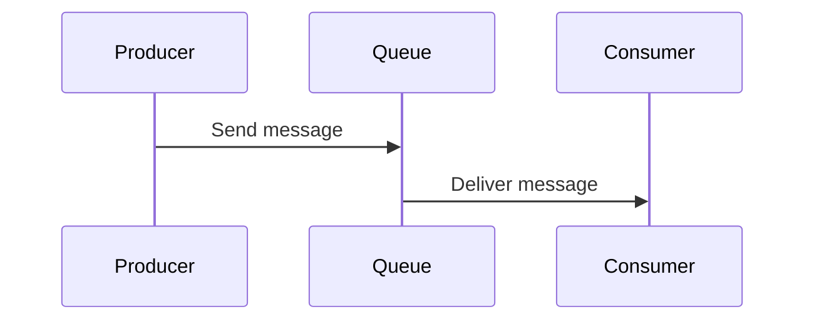
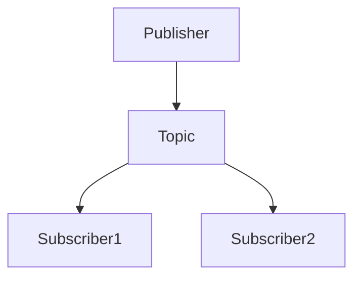
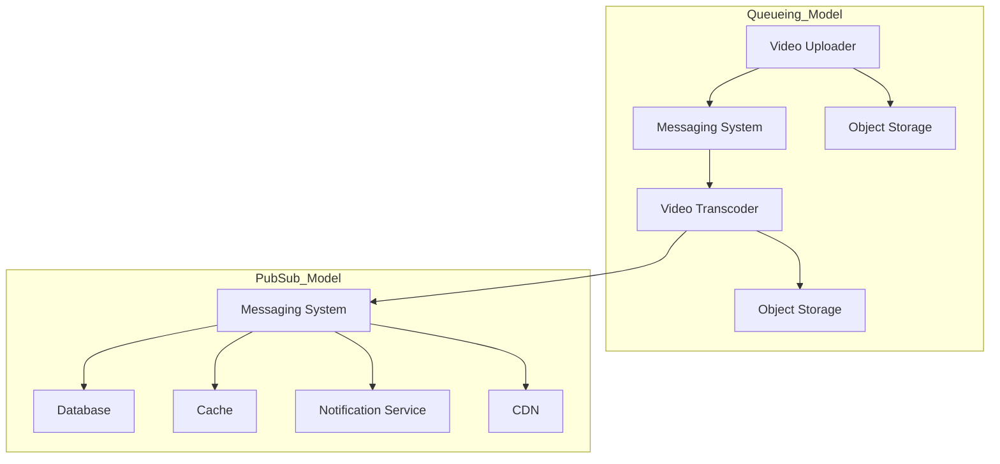
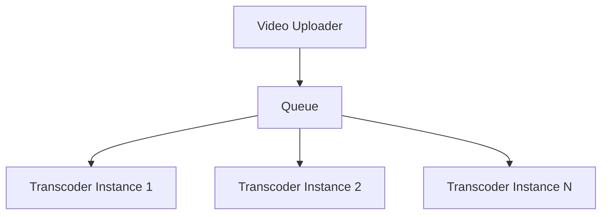
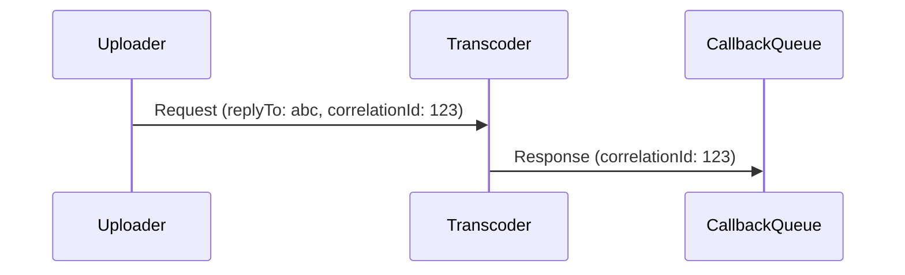
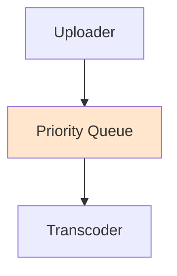
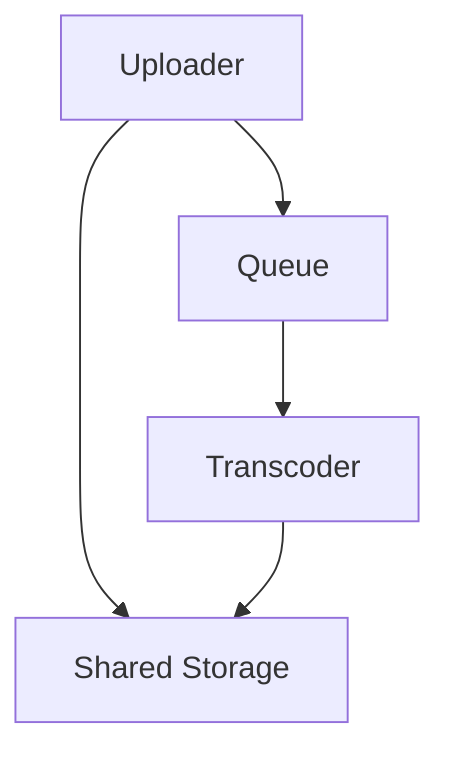

# Asynchronous Messaging Patterns

Asynchronous messaging patterns are communication techniques that allow systems and services to interact without blocking operations, enabling scalability, fault tolerance, and better resource utilization.

---

## 1. Message Queuing (Point-to-Point)

In this pattern, a producer sends messages to a queue, and each message is consumed by only one consumer.



---

## 2. Publish/Subscribe (Pub/Sub)

In this pattern, a publisher sends messages to a topic. All subscribers to that topic receive a copy.



---

## 3. Queueing Model vs. Pub/Sub Model (Video Processing Example)

This represents the flow of a video processing pipeline using both queueing and publish/subscribe models.


---

## 4. Competing Consumers

Multiple consumer instances process messages from a shared queue in parallel.



---

## 5. Request/Response Messaging

Asynchronous communication with response tracking using `replyTo` and `correlationId`.




---

## 6. Priority Queue

### Native Support in a Single Queue:



### Separate Queues for Each Priority:

```mermaid
flowchart TD
    Uploader --> Q1[Queue (Priority 1)]
    Uploader --> Q2[Queue (Priority 2)]
    Q1 --> T1[High Priority Transcoder Pool]
    Q2 --> T2[Low Priority Transcoder Pool]
```

---

## 7. Claim Check Pattern

Stores large payloads externally and passes references in messages.



- The queue contains a small message with a reference to the large file stored in shared storage.
- Transcoder retrieves the actual file using the reference.


---

